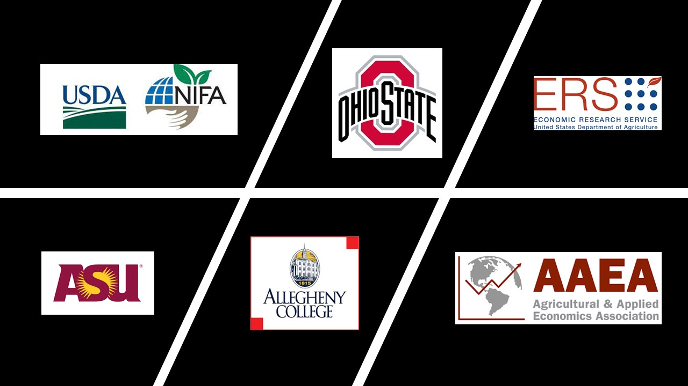

---
title:
output:
  html_document:
    theme: cerulean
    highlight: tango
---
<style>
body {
text-align: justify}
</style>

<br>
<br>

## Partners

```{r echo=FALSE, out.width="600px", fig.align='center'}



```
<br>
<br>

+ **United States Department of Agriculture**
+ **Ohio State University**
+ **Economic Research Service**
+ **Arizona State University**
+ **Allegheny College**
+ **Agricultural and Applied Economics Association**